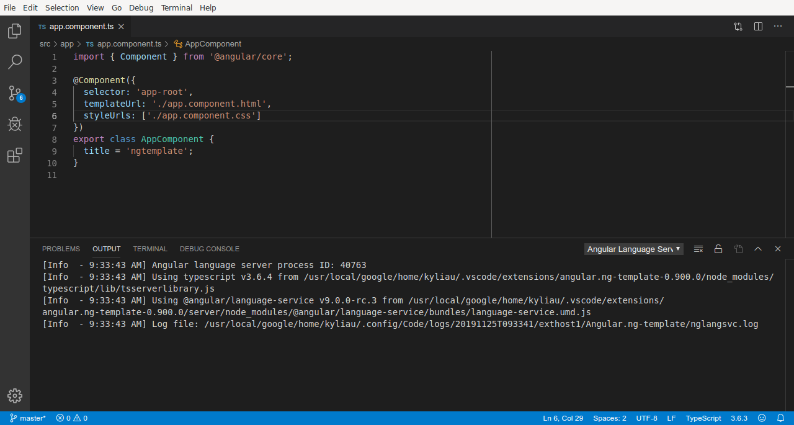

**Describe the bug**

A clear and concise description of what the bug is.

If the bug is caused or experienced by a particular source code, please provide a minimal
reproduction of that source code.

**To Reproduce**

Steps to reproduce the behavior:
1. Go to '...'
2. Click on '....'
3. Scroll down to '....'
4. See error

**Expected behavior**

A clear and concise description of what you expected to happen.

**Logs**

Please attach two logs:

1. Console output (Go to toolbar --> View --> Output, and copy the contents)
2. Log file (Path is printed to the console output at startup)

**Screenshots**

If applicable, add screenshots to help explain your problem.

**Additional context**

Add any other context about the problem here.
